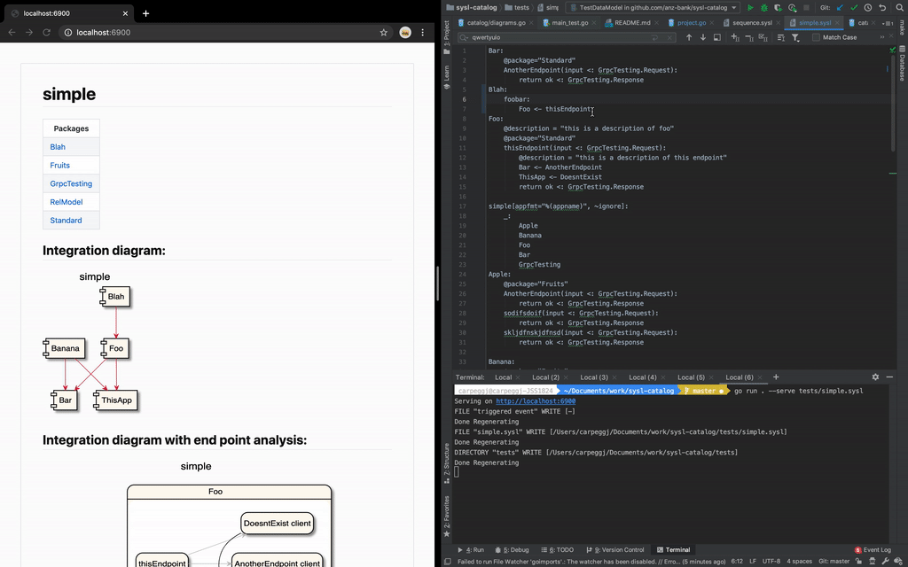
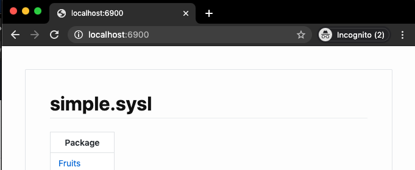
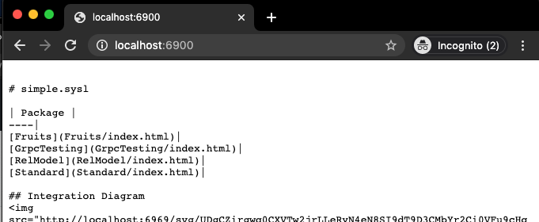
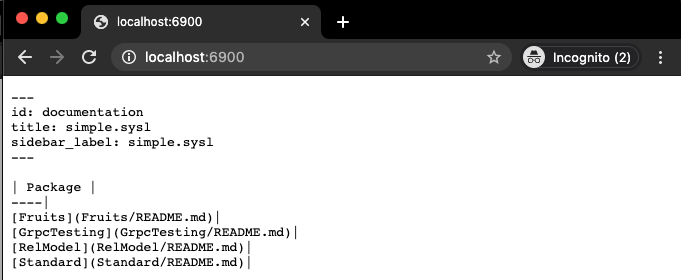
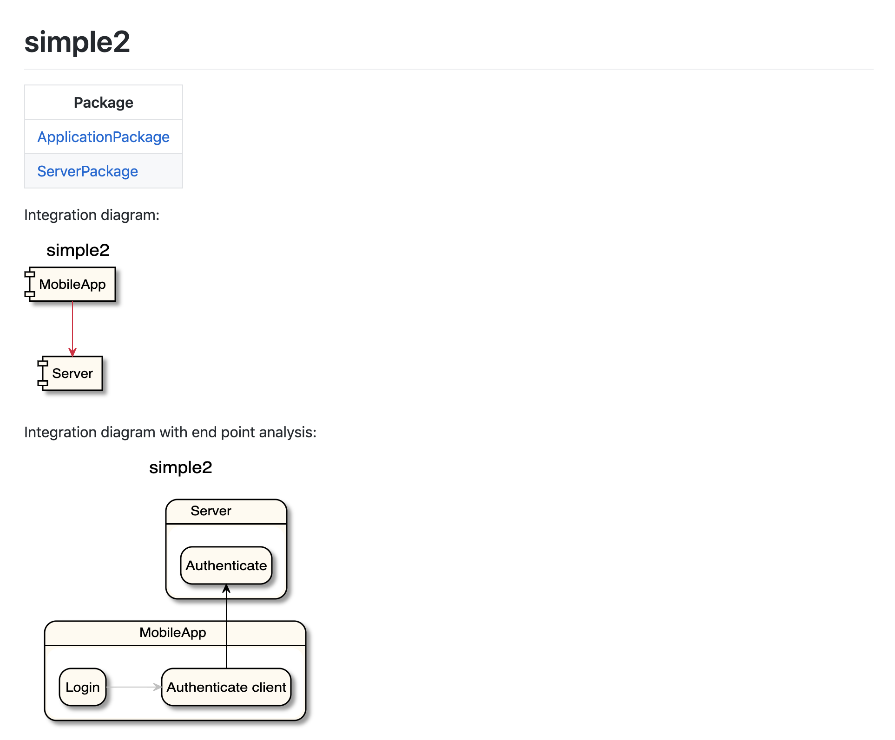
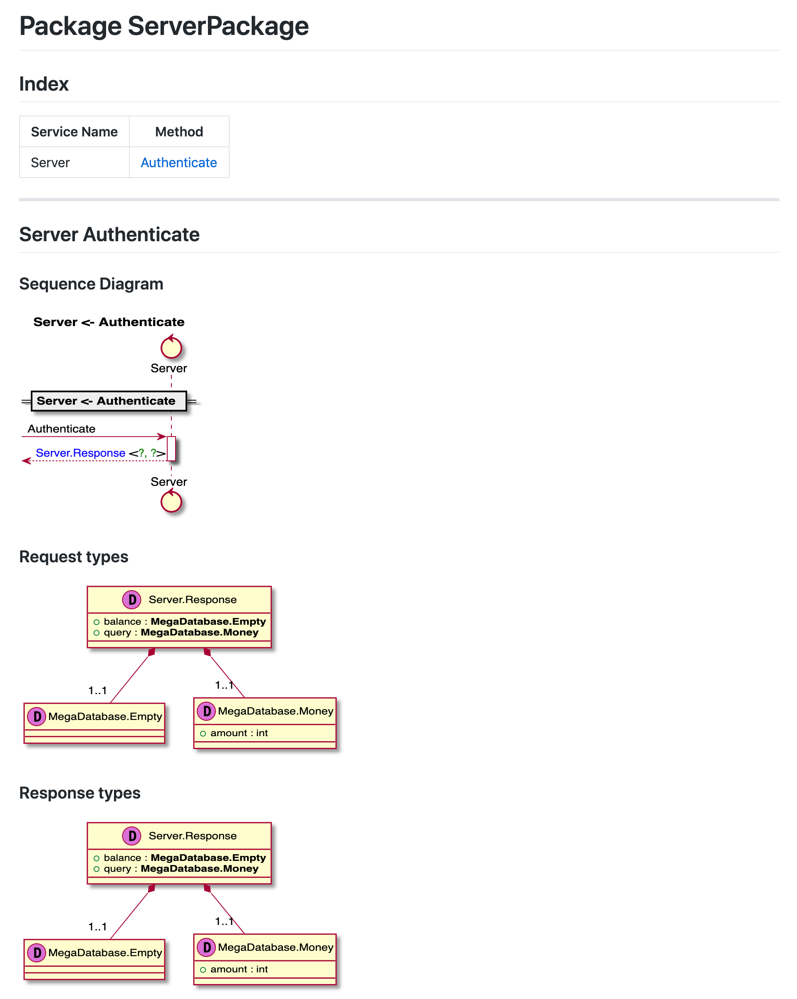

# sysl-catalog

A markdown/html + Diagram generator for sysl specifications
## Objective
The objective of sysl-catalog is to create the most seamless experience for developers to document their API behaviour, as well as creating a standardised way multiple teams can create documentation whilst gaining mutual benefit from already existing documentation.

## Background
Let’s say that a team wants some diagrams to represent how their services interact with other services. First, the team needs to choose what format to use, then the team needs to decide on where the docs are going to be hosted, and how often they should be updated.

Let’s say that this team (Team A) chooses plantuml to create sequence, data model, and integration diagrams for their service. They choose to generate to a docs directory on their single repository and use some proto plugins to automate their markdown generation: 
- Protoc-gen-doc to generate a digest of what how their protos are structured
- Protoc-gen-uml to generate plantuml diagrams to generate diagrams for the needed diagrams
- Manually written markdown to describe how their services interact with different services
- Manually written sequence diagrams to describe which dependencies are called

This works fine; the team has somewhat automated their documentation workflow, with some manual parts. 

A couple of months pass and now there’s another team which relies on team A’s service heavily. They are releasing soon and need to create release documentation; so they decide to use the same method that Team A is using. 

Now there’s a problem; there are two teams with two separate sets of documentation. Some of it is manual and some of it is automated. This can cause problems for multiple reasons;
1. Manually written parts might need to be repeated and might fall out of sync across the two sources
2. If manually written documentation isn't repeated then the representation of their dependency is limited by a hyperlink to Team  A's documentation without fully integrating
3. The decoupling of documentation and code means that the documentation is most likely going to fall out of date
4. Because there’s no persistence between team A’s documentation and Team B; if team A make a very specific change it likely won’t show in team B’s documentation

This is what sysl-catalog is trying to solve

sysl-catalog uses the sysl language as an intermediary between different formats to be able to generate different views of how services work

What is sysl?
Sysl is a “system specification language”; think of it like swagger or protos, but a much higher level, and with the ability to represent not only types, applications and endpoints, but interactions between those applications and endpoints; it plans to define what the code does itself.

What does sysl-catalog do?

Sysl-catalog is just a static site generator.

Sysl-catalog parses a sysl file (with the .sysl extension) and represents it in a visual form;
It can represent endpoints (in sequence diagrams) request/response types or database tables, as well as integration diagrams. 

It uses go's `text/template` to do this, and if any addition is needed to be made, custom templates can be used (see `templates` for examples)

## Installation

#### go
```bash
go get -u -v github.com/anz-bank/sysl-catalog
```
#### docker
- only recommended for `--serve` mode
```bash
docker run --rm -p 6900:6900 -v $(pwd):/usr/:ro anzbank/sysl-catalog:latest input.sysl --serve
```
#### docker-compose
- see (demos)[demo/protos] for full example that includes .proto files
```yaml
version: '3.8'

services:
  plantuml-server:
    image: plantuml/plantuml-server:tomcat-v1.2020.13
    ports:
      - 8080:8080
  protoc-gen-sysl:
    image: anzbank/protoc-gen-sysl:latest
    volumes:
      - ./:/usr/files
    working_dir: /usr/
    entrypoint: ["protoc", "--sysl_out=.", "files/simple.proto"]
  sysl-catalog:
    image: anzbank/sysl-catalog:latest
    volumes:
      - ./:/usr/
    environment:
      - SYSL_PLANTUML=http://plantuml-server:8080
    entrypoint: ["sysl-catalog", "-o", "docs", "project.sysl", "--imageDest", "docs/images"]
    depends_on:
      - plantuml-server
      - protoc-gen-sysl
```


## How to use
1. Set up environment
`export SYSL_PLANTUML=http://www.plantuml.com/plantuml`

2. Run 

```bashs
sysl-catalog -o <output directory> <input.sysl>
```
- You can optionally specify the `--type=html` if you want to generate html instead of markdown, which is useful for use with github pages, which you can see a demo of with this repo [here](https://anz-bank.github.io/sysl-catalog/)

3. That's it (basically!)

    This will generate markdown with integration diagrams + sequence diagrams + data model diagrams as seen in [demo/markdown/README.md](demo/markdown/README.md) or see html generation at [demo/html/index.html](demo/html/index.html).


## Server Mode
sysl-catalog comes with a `serve` mode which will serve on port `:6900` by default

```bash 
sysl-catalog --serve <input.sysl>
```
This will start a server and filewatchers to watch the input file and its directories recursively, and any changes will automatically show:


## Requirements
In [demo/markdown/README.md](demo/markdown/README.md) we have an example with a couple of interesting parts:


1. `@package` attribute must be specified:
- This will create a markdown page for `ApplicationPackage` as seen in [demo/markdown/ApplicationPackage/README.md](demo/markdown/ApplicationPackage/README.md).
 Currently the package name is not inferred from the application name (`MobileApp`), so this needs to be added (`ApplicationPackage`).
```
MobileApp:
    @package = "ApplicationPackage"
    Login(input <: Server.Request):
        Server <- Authenticate
        return ok <: MegaDatabase.Empty
```

2. Application names might need to be prefixed to parameter types if the type is defined in another application, since defined parameters are under scope of the application it is defined in:
```diff
MobileApp:
    @package = "ApplicationPackage"
+    Login(input <: Server.Request):
-    Login(input <: Request):
        Server <- Authenticate
        return ok <: MegaDatabase.Empty
```

3. Add `~ignore` to applications/projects that are to be ignored in the markdown creation
```diff
ThisAppShouldntShow[~ignore]:
    NotMySystem:
        ...
# Or ignore only specific endpoints
ThisAppShouldShow[~ignore]:
    NotMySystem[~ignore]:
        ...
```

## CLI options

#### Output default Markdown
`sysl-catalog -o=docs/ filename.sysl`

#### Output default HTML
`sysl-catalog -o=docs/ --type=html filename.sysl`

#### Run with custom templates
- With this the first template will be executed first, then the second
`sysl-catalog --templates=<fileName.tmpl>,<filename.tmpl> filename.sysl`

#### Run in server mode
`sysl-catalog --serve filename.sysl`


#### Generate Redoc files
`sysl-catalog --redoc filename.sysl`
This generates a [Redoc](https://github.com/Redocly/redoc) page that serves the original .json or .yaml OpenAPI spec on Github. Currently only supports spec files located in the same repo, and must be run in a git repo (so that the remote url can be retrieved using `git`).

#### Run in server mode without css/rendered images
- good for rendering raw markdown

`sysl-catalog --serve --noCSS filename.sysl`

#### Run server with custom template
`sysl-catalog --serve --templates=<fileName.tmpl>,<filename.tmpl> filename.sysl`



- See templates/ for custom template examples

## Screenshots

*project_view*


*package_view*
